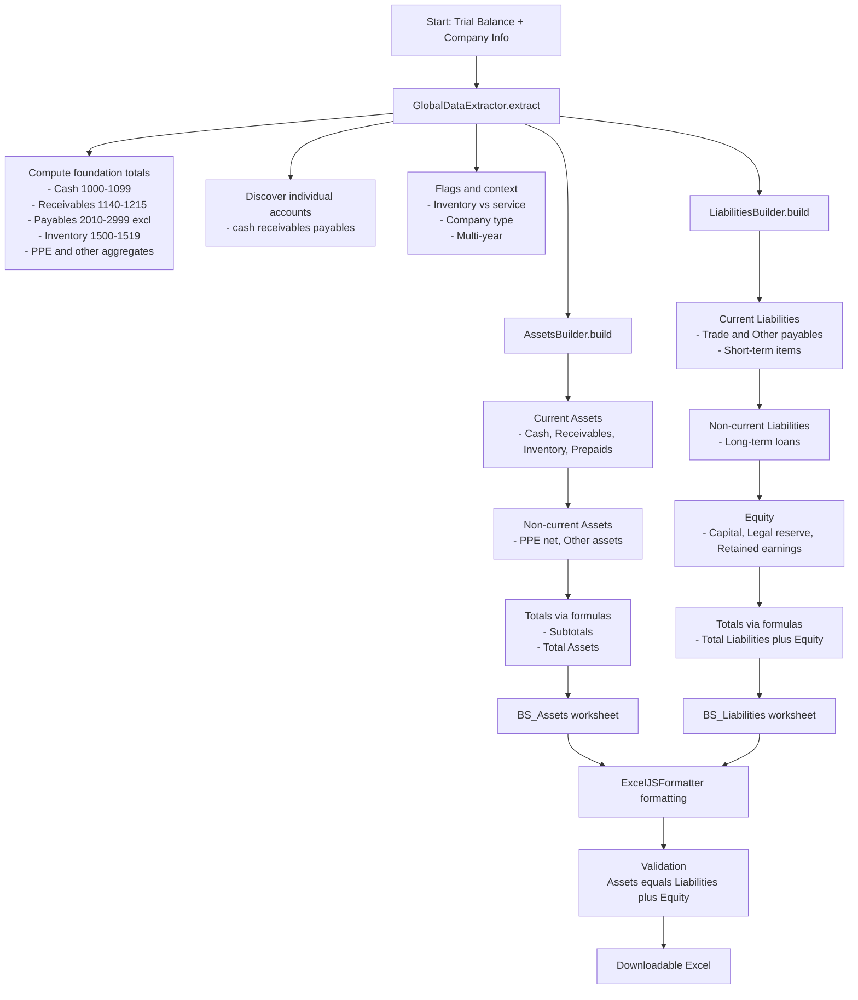

# Balance Sheet Flow Diagrams

This page documents how the Balance Sheet’s Assets and Liabilities/Equity are constructed in this project.

Tip: You can view these Mermaid diagrams directly in VS Code (Markdown preview) or on GitHub.

## High-level build flow

## Function call flow (exact methods)

```mermaid
flowchart TD
  A[FinancialStatementGenerator.generateFinancialStatements] --> B[GlobalDataExtractor.extract]
  A --> C[AssetsBuilder.build]
  A --> D[LiabilitiesBuilder.build]
  A --> E[downloadAsExcel]
  E --> F[ExcelJSFormatter.addDataToWorksheet BS_Assets]
  E --> G[ExcelJSFormatter.addDataToWorksheet BS_Liabilities]
  E --> H[ExcelJSFormatter.formatBalanceSheetAssets]

  %% Assets
  C --> C1[FinancialCalculations.sumAccountsByNumericRange]
  C --> C2[FinancialCalculations.sumPreviousBalanceByNumericRange]
  C --> C3[FinancialCalculations.buildSumFormula]

  %% Liabilities and Equity
  D --> D1[buildCurrentLiabilitiesSection]
  D --> D2[buildNonCurrentLiabilitiesSection]
  D --> D3[buildEquitySection]

  D1 --> DC[sumAccountsByNumericRange and sumPrevious]
  D1 --> DF[buildSumFormula]
  D2 --> DG[sumAccountsByNumericRange and sumPrevious]
  D2 --> DH[buildSumFormula]
  D3 --> DI[getSingleAccountBalance 3010]
  D3 --> DJ[getOpeningRetainedEarnings]
  D3 --> DK[calculateCurrentYearProfit]
  D3 --> DL[buildSumFormula]
```

## How to view

- VS Code: open this file and use Markdown Preview (Ctrl+Shift+V). If Mermaid doesn’t render, install the extension “Markdown Preview Mermaid Support” (bierner.markdown-mermaid).
- GitHub: commit and push; open this file on GitHub and Mermaid will render automatically.
