# Notes Function Flows

Function-level flows for each note generator that uses the row tracking architecture. Labels are sanitized for Mermaid.

## Conventions
- Nodes avoid quotes, parentheses, and special punctuation
- Multi-year handling shown when relevant
- Tracker fields: headerRows, yearHeaderRows, detailRows, totalRows, unitRows

---

## Cash Note (Note 7)

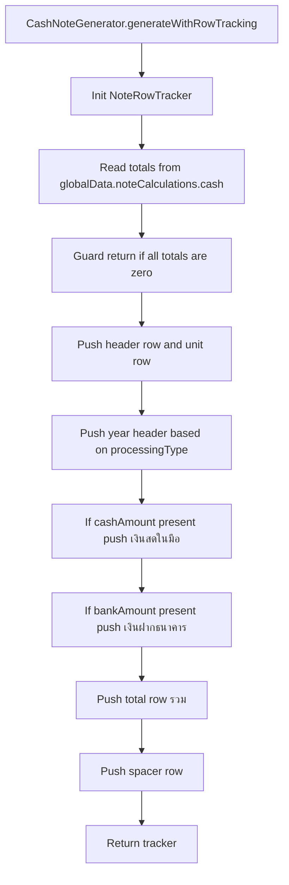

## Trade Receivables Note (Note 8)

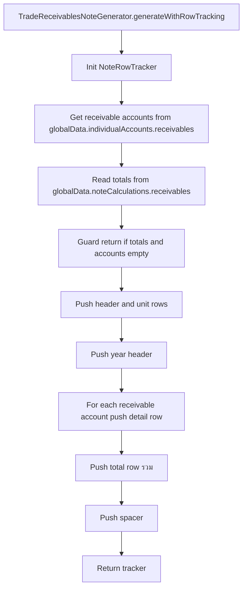

## Trade Payables Note (Note 12)

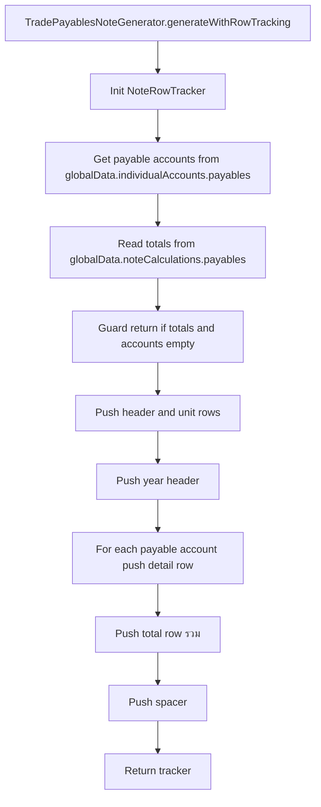

## PPE Note (Note 10)

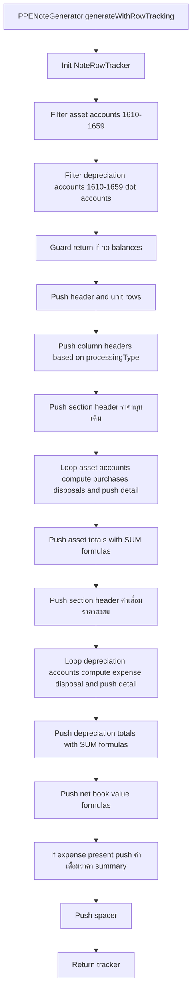

## Short Term Loans Note (Note 5)

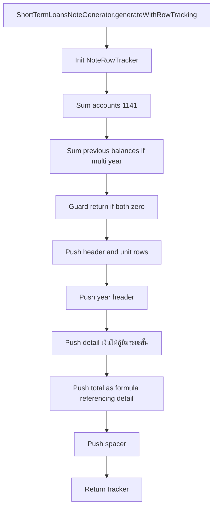

## Other Assets Note

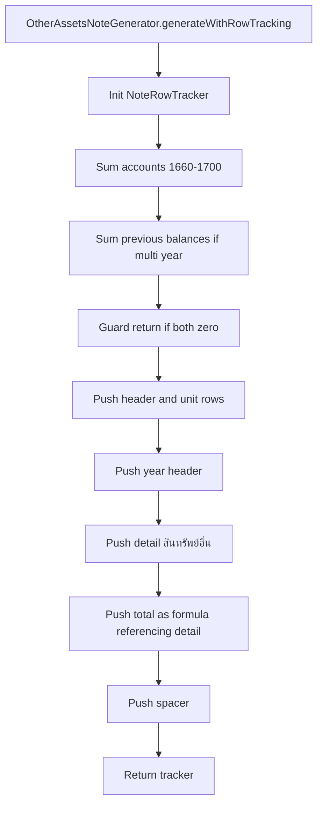

## Long Term Loans from FI Note

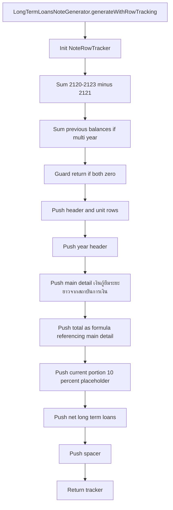

## Other Long Term Loans Note

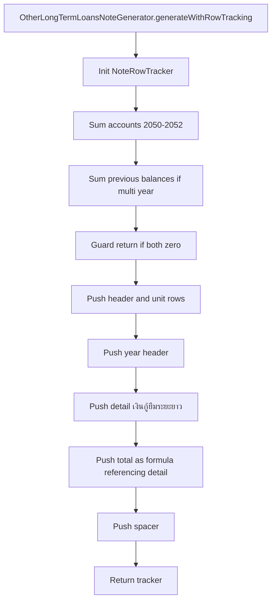

## Related Party Loans Note

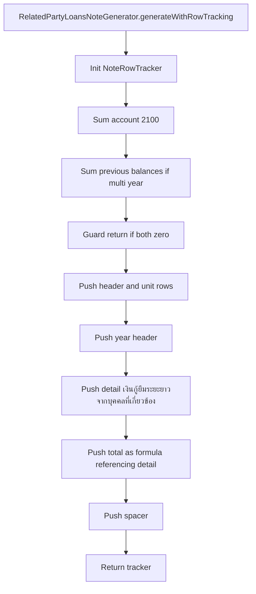

## Other Income Note

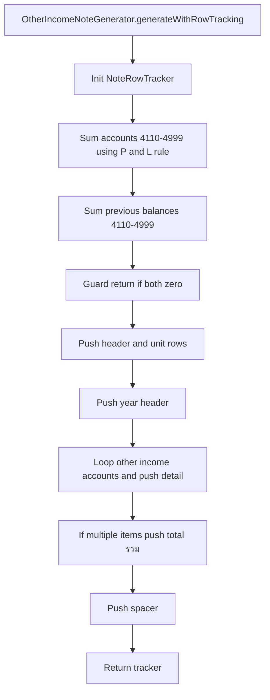

## Expenses By Nature Note

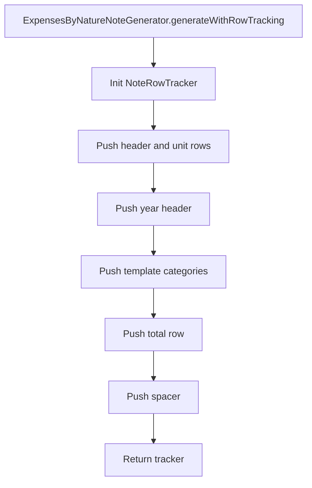
